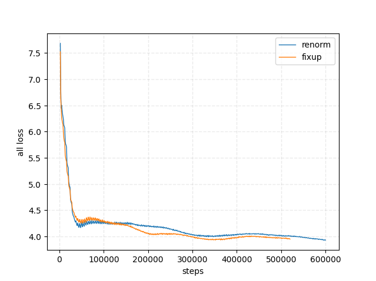
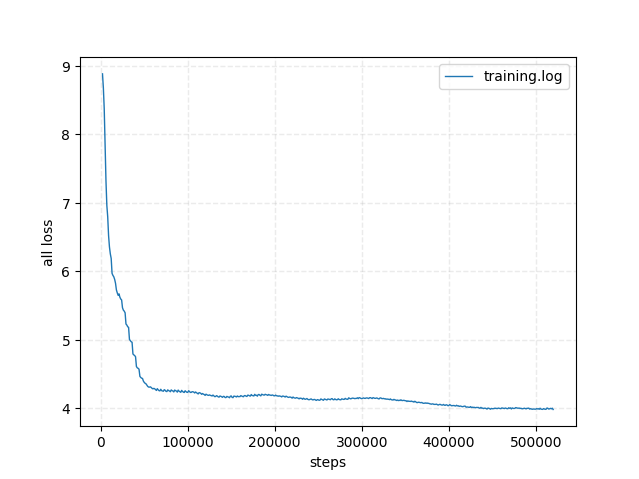
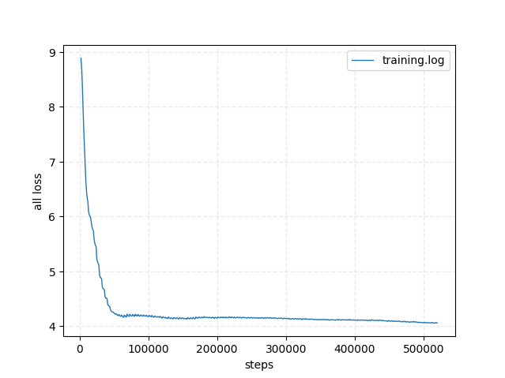
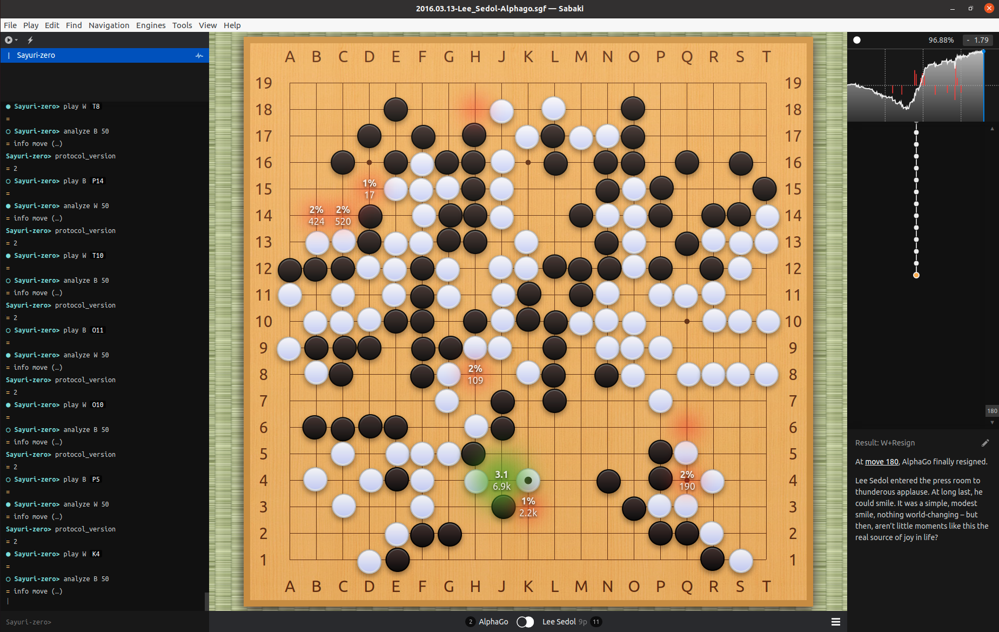
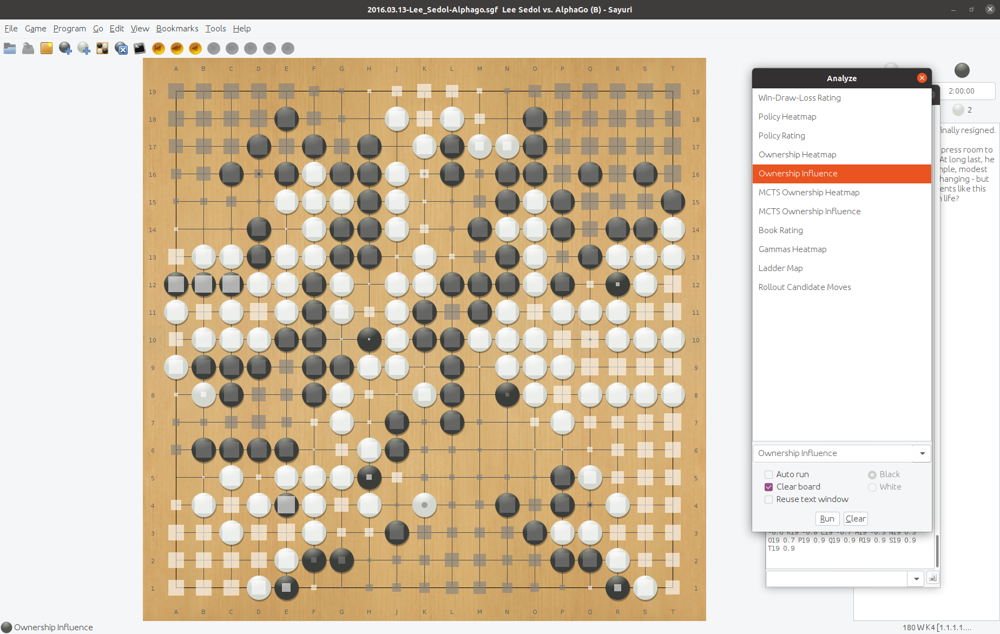
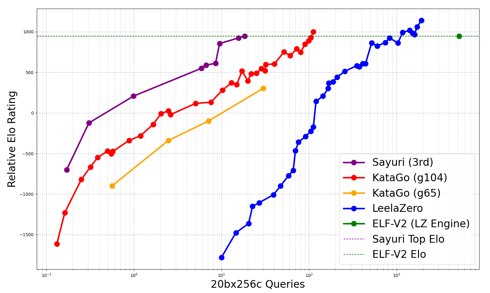

<div id="sayuri-art" align="center">
    </br>
    
    <h3>Sayuri</h3>
</div>

# TensorRT backend for ONNX

This is a prototype of the TensorRT backend for ONNX (onnx-tensorrt) designed for Sayuri.
AQ already adopted this method (using UFF instead of ONNX) in 2018, but there were still many restrictions at that time, so it was not adopted in the Go engine for a while.
Also added the following features:
* Muon+AdamW optimizer
* torch.compile
* Fixup Initialize
* Transformer model for demonstration purposes

## Requirements

Additional features require the following installation:

* c++ engine: onnx runtime (Used onnxruntime-linux-x64-1.25.1 to check the operation)
* python: pip install onnxruntime-gpu onnx onnxscript

## Running the training

You can check these features by setting the following in selfplay-setting.json.
```
    "NeuralNetwork" : {
        "BatchNormMode" : "fixup", ... "renorm"(default), "norm" to use the conventional function
        "IsPreAct" : true, ... Set to true if using a Transformer model, otherwise set to false.
        "UseRoPE" : true,
        "RoPETheta" : 100.0,
        "LearnableRoPE" : false,
        "AttentionQKNorm" : false,
        "UseGAB" : false,
        "GABD1" : 16,
        "GABD2" : 16,
        "UseTAB" : false,
        "InlineRegisters" : false,  ... Add Register tokens
        "AttentionNumRWRegisters" : 16,
        "GABNumTemplates" : 32,
        "GABNumFourierFeatures" : 12,
        "GABMLPHidden" : 96,
        "TABCZ" : 32,
        "TABNumTemplates" : 32,
        "TABNumFreqs" : 8,
        "TABNumBlocks" : 3,
        "TABDilation" : 3,
        "TABUseFrequencyMixing" : false,
        "UseSwiGLU" : true,
        "TransformerFFNDepthwiseConv" : false,
        "UseTrunkChannelGate" : false, ... KataGo's unique new features
        "UseTrunkResidualBackout" : false, ... KataGo's unique new features
        "Stack" : [
            { "Block": "TransformerBlock",
              "Args": {
                  "TransformerHeads" : 3,
                  "TransformerKVHheads" : 3,
                  "AttentionQueryHeadDim" : 32,
                  "AttentionValueHeadDim" : 32,
                  "TransformerFFNChannels" : 256,
              }
            },
            ...
    "Train" : {
        "Optimizer" : "Muon", ... "Adam", "SGD" (default) to use the conventional function
        "LearningRateSchedule" : [
            [0,     3.2e-4 or 3.2e-5] ... For Muon, operation has been confirmed with 3.2e-4 (default:0.2)
                                          When using the Transformer model, used 3.2e-5.
        "ExportONNX" : true, ... New key(default:false)
        "UseCompile" : true, ... New key(default:false)
```

## Test results for the b3xc96 model

In the renorm test, after step 520K, the value of "RenormMaxD" in selfplay-setting.json was changed from 4 to 5.



## About the Transformer model

The Transformer model currently implemented is merely a prototype for demonstration purposes.
Various improvements are needed to make it more powerful.

## Additional test (2026/05/16)

These are the test results for a hybrid configuration model (ResidualBlock -> ResidualBlock -> TransformerBlock).
The configuration definition used is located in the bash/configs/sample folder.
The log files are located in the train/log folder.



## Additional test (2026/05/19)

These are the test results for a hybrid configuration model (ResidualBlock -> ResidualBlock -> TransformerBlock).
"UseRoPE" : true
"LearnableRoPE" : true
"AttentionQKNorm" : true
"InlineRegisters" : true
The configuration definition used is located in the bash/configs/sample folder.
The log files are located in the train/log folder.



## Let's ROCK!

**Sayuri** is a GTP-compliant Go engine built on Deep Convolutional Neural Networks and Monte Carlo Tree Search. It learns to play Go from scratch using an AlphaZero-style algorithm, without any handcrafted human strategies. Inspired heavily by **Leela Zero** and **KataGo**, Sayuri initially borrowed its board data structures, search algorithms, and network format from Leela Zero. In later versions, the engine follows KataGo's research and now supports variable rulesets, komi settings, and board sizes.

For development insights and reports, see:
* [Development Log (in Chinese)](https://hackmd.io/@yrHb-fKBRoyrKDEKdPSDWg/BJgfay0Yc)
* [Performance Report before UEC15 (v0.6)](https://drive.google.com/file/d/1ATd_u-E-OnviczsDH8wVL0c3Q1NzUCKW/view?usp=share_link)


## Quick Start via Terminal

To run the engine, you need a executable weights first. The released weights can be got from this [page](./docs/MODEL.md). Then launching the engine with GTP mode via the terminal/PowerShell, using 1 thread and 400 visits per move with optimistic policy. Please type

    $ ./sayuri -w <weights file> -t 1 -p 400 --use-optimistic-policy


After executing the command, you'll see diagnostic output. If this output includes ```Network Version```, it indicates that the engine is successfully running in GPT mode. However, since GPT mode isn't designed for human interaction, you should use the graphical interface (GUI) instead. Please refer to the **Graphical Interface** section for more details.

For a list of additional command-line arguments, use the --help option. Please type:

    $ ./sayuri --help

The default engine uses a Chinese-like rule, which has a tendency to keep playing to remove some dead stones, even when their ownership of an area is clear. This can lead to unwanted capturing moves. To prevent these unnecessary moves, you have two options. First, while using the Chinese-like rule, add the ```--friendly-pass``` option. Second, switch to a Japanese-like rule by using the ```--scoring-rule territory``` option.

You can utilize the pure Python engine with a checkpoint model. The released checkpoint models could be found from this [page](./docs/MODEL.md). Although the Python engine is significantly weaker than the C++ engine, it makes running the raw model much easier. More detail you may see [here](./train/README.md).

    $ python3 train/torch/pysayuri.py -c model.pt --use-swa

## Execute Engine via Graphical Interface

Sayuri is not complete engine. You need a graphical interface for playing with her. She supports any GTP (version 2) interface application. [Sabaki](https://sabaki.yichuanshen.de/) and [GoGui](https://github.com/Remi-Coulom/gogui) are recommended because Sayuri supports some specific analysis commands.

* Sabaki analysis mode



* GoGui analysis commands



## Build From Source

For instructions on building from source, please refer to this [section](./docs/COMPILE.md). If you are using Windows, you can download a precompiled executable directly from the release page.

## Reinforcement Learning

Sayuri is a highly efficient self-play learning system for the game of Go that focuses on computational efficiency. In her v0.7 release, Sayuri’s training cost (represented by the purple line) is notably lower than that of both KataGo and Leela Zero. Compared to ELF OpenGo, Sayuri requires approximately 250× less computation. The complete training run was conducted in three months using a single RTX 4080 GPU. By comparison, KataGo’s g104 version reports a reduction of around 50×, making Sayuri’s efficiency improvement considerably larger.

For details on how to run the self-play loop, please refer to this [guide](./bash/README.md).



## Acknowledge

TensorRT Backend: The TensorRT backend has now been implemented in this project. Special thanks to [MAOmao000](https://github.com/MAOmao000) for providing a fully functional [TensorRT version](https://github.com/MAOmao000/Sayuri-TensorRT) and verifying that it delivers approximately 1.5x the performance of the original CUDA backend. Much of the TensorRT backend implementation in this project was adapted from that version and integrated to match the coding style of Sayuri.

## Other Resources

* Go Text Protocol, [https://www.gnu.org/software/gnugo/gnugo_19.html](https://www.gnu.org/software/gnugo/gnugo_19.html)
* Leela Zero, [https://github.com/leela-zero/leela-zero](https://github.com/leela-zero/leela-zero)
* KataGo methods, [https://github.com/lightvector/KataGo/blob/master/docs/KataGoMethods.md](https://github.com/lightvector/KataGo/blob/master/docs/KataGoMethods.md)
* [YouTube](https://www.youtube.com/watch?v=82UclNrXGxg), playing with Pachi.
* Supported analysis commands, [analyze](./docs/ANALYZE.md).
* [AlphaZero 之加速演算法實作 (v0.4~v0.5)](https://hackmd.io/@yrHb-fKBRoyrKDEKdPSDWg/HJI9_p70i), describe some methods for old version.

## License

The code is released under the GPLv3, except for threadpool.h, cppattributes.h, Eigen and Fast Float, which have specific licenses mentioned in those files.

## Contact

cglemon000@gmail.com (Hung-Tse Lin)
