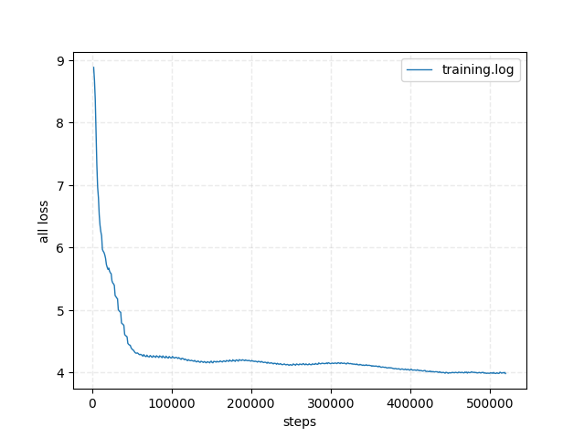
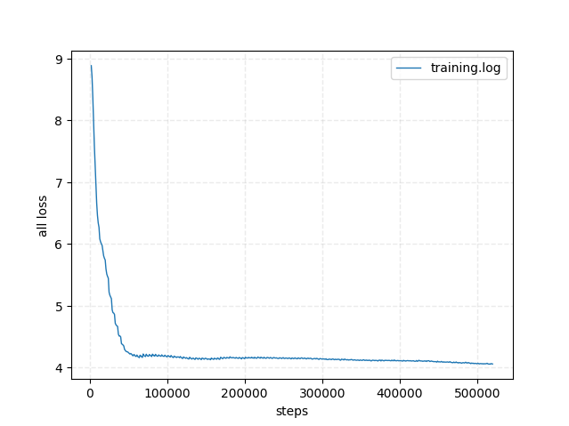
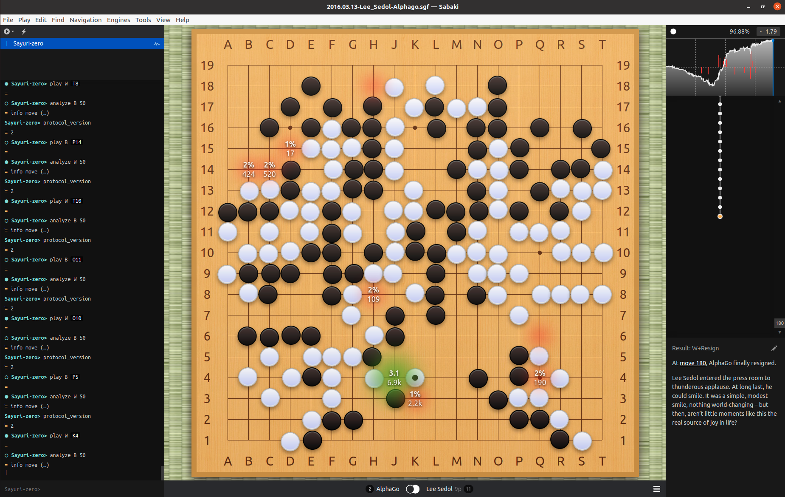
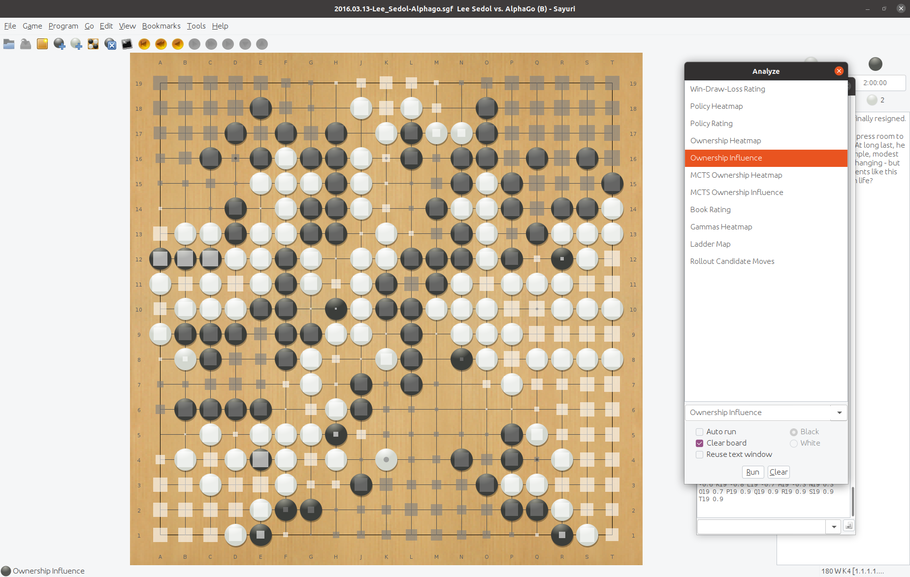
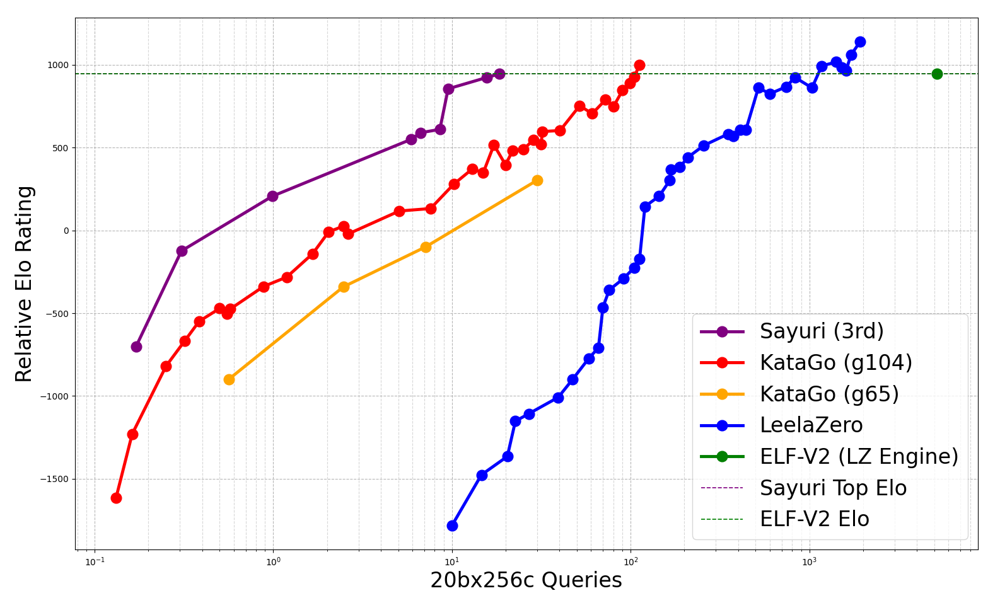

<div id="sayuri-art" align="center">
    </br>
    
    <h3>Sayuri</h3>
</div>

# TensorRT backend for ONNX

This is a prototype of the TensorRT backend for ONNX (onnx-tensorrt) designed for Sayuri.
AQ already adopted this method (using UFF instead of ONNX) in 2018, but there were still many restrictions at that time, so it was not adopted in the Go engine for a while.
Also added the following features:
* Muon+AdamW optimizer
* Aurora+AdamW optimizer
* torch.compile
* TransformerAttention model for demonstration purposes
* Cyclic cosine annealing

## Requirements

Additional features require the following installation:

* c++ engine: onnx runtime (Used onnxruntime-linux-x64-1.25.1 to check the operation)
* python: pip install onnxruntime-gpu onnx onnxscript

## Modification of configuration definitions (selfplay-setting.json)

Additional configuration definitions (selfplay-setting.json):
```
  "NeuralNetwork" : {
    "ReductionInput": false(default)  # Should it be trained using minimal local input features? (true|false)
    "FFNExpansionRatio": 1.5(default) # What should be the multiplier for the number of output channels of the convolution
                                      # immediately following the DepthwiseConv in MixerBlock,
                                      # relative to the number of channels in the intermediate layer?
    "TransformerDropRate": 0.0(default) # Dropout rate used in the TransformerAttentionBlock.
    "BatchNormMode": "renorm"(default)  # Type of batch normalization to use. ("renorm"|"norm"|"fixup")
                                        # In the TransformerAttentionBlock, RMSNorm is fixed.
    "PreActivation": false(default) # Should batch normalization and activation be performed before the convolution? (true|false)
                                    # In the TransformerAttentionBlock, PreNorm is fixed.
    "FinalBlockCgroupSize": None(default) # If specified, RMSNorm is performed using this group size at the end of the intermediate layer's iterative processing.
    "AttentionQKNorm": true(default)  # RMSNorm on Q and K per-head before the attention dot product. (true|false)
    "TransformerHeads": 3(default)    # The number of parallel heads processed in Multi-Head Attention.
    "TransformerKVHheads": 3(default) # The number of parallel heads processed in Multi-Head Attention.
    "AttentionQueryHeadDim": 64(default) # Query size (number of dimensions) per head.
                                         #  = Hidden layer dimension / Number of attention heads.
                                         # The recommended value is 64.
    "AttentionValueHeadDim": 64(default) # Value size (number of dimensions) per head.
                                         #  = Hidden layer dimension / Number of attention heads
                                         # The recommended value is 64.
    "LearnedRoPECastToInputDtype": false(default) # Under AMP, cast the small cos/sin rotation tables to the input dtype
                                                  # before the batch-sized Q/K rotation,
                                                  # instead of promoting the batch-sized rotation intermediates to FP32.
                                                  # The trigonometric functions themselves remain FP32.
    "TransformerFFNChannels": 384(default) # Expanded channel count of the Feed-Forward Network within the TransformerAttentionBlock
                                           # Typically four times the hidden layer dimension.
    "UseSwiGLU": true(default) # Should SiLU be used for the activation within the Feed-Forward Network of the TransformerAttentionBlock? (true|false)
                               # If set to false, the activation function specified in "Activation" is used.
    "TransformerFFNDepthwiseConv": true(default) # Should DepthwiseConv be used within the feed-forward network of a TransformerAttentionBlock? (true|false)
    "UseTAB": false(default) # Should we use Topological Attention Bias? (true|false)
    "TABD1": 16(default) # Number of output channels for TAB first Layer.
    "TABD2": 16(default) # Number of output channels for TAB second Layer.
    "TABCZ": 32(default) # Number of TAB frequencies.
    "TABNumTemplates": 32(default) # Number of TAB templates.
    "TABNumFreqs": 8(default)  # Number of TAB frequencies.
    "TABNumBlocks": 3(default) # Number of TAB blocks.
    "TABDilation": 3(default)  # Dilation for conv2d in TAB.
    "UseFlexAttention": false(default)  # Should we use PyTorch's FlexAttention? (true|false)
                                        # At present, torch.onnx.export does not support this;
                                        # setting it to true will cause the training process to terminate abnormally.
    "AttnLogitPenaltyCap": None(default)      # Penalize attention layers whose per-head logit upper bound (scale * max||q|| * max||k||, incl off-board positions) exceeds this. None = disabled.
    "AttnLogitPenaltyCoeff": 1e-3(default)    # Loss coeff for the attention logit bound penalty (linear hinge, mean over heads, sum over layers, per sample)
    "AttnLogitPenaltyBatchFrac": 1.0(default) # Compute the attention logit penalty on only this fraction of each batch (cuts its cost proportionally, adds gradient variance)
  "Train" : {
    "HeadLrFactor": 0.5(default)     # LR factor for output head weights.
    "NoregLrFactor": 1.0(default)    # LR factor for noreg params. (biases, norms)
    "MuonAdamLrFactor": 1.0(default) # LR factor for muon-ineligible (adam) params when using muon.
    "InputWdFactor": 1.0(default)    # Extra scaling factor for input weight decay.
    "NormalWdFactor": 1.0(default)   # Extra scaling factor for normal weight decay.
    "NormalAttnWdFactor": 1.0(default)  # Extra scaling factor for normal_attn weight decay.
    "AnnealingCycle": 0(default)        # Learning rate annealing cycle (number of steps).
    "AnnealingMinCoeff": 0.1(default)   # When "AnnealingCycle" > 0, 
                                        # the value obtained by multiplying the specified learning rate by this value
                                        # is used as the minimum learning rate.
    "ExportONNX": false(default)        # Should we export the trained model using torch.onnx.export? (true|false)
    "UseDynamo": True(default)          # Should we use TorchDynamo when exporting with torch.onnx.export? (true|false)
    "UseCompile": false(default)        # Should we use torch.compile? (true|false)
    "UseBatchedMuonNs": false(default)  # Stack Muon updates with the same
                                        # matrix shape (up to KATAGO_MUON_NS_BATCH_SIZE, default 32) into a single
                                        # compiled Newton-Schulz iteration rather than one launch sequence per
                                        # parameter. Same update equations, but not bitwise identical to the scalar launches.
    "UseForeachAuxAdam": false(default) # Use torch._foreach multi-tensor kernels for the auxiliary Adam parameter groups.
    "MuonNsBatchSize": 32(default)      # Newton-Schulz batch size.
    "WdFloorFraction": None(default)    # Exempt from weight decay the part of each output channel of each weight matrix
                                        # whose RMS is below this fraction of the tensor's RMS at initialization,
                                        # so that unused channels never decay to exactly zero,
                                        # a state Muon cannot recover from.
                                        # Can be changed between runs.
                                        # Requires muon.
```
Deletion configuration definition (selfplay-setting.json):
```
  "Train" : {
    "RenormMaxR": 1(default)
    "RenormMaxD": 0(default)
```

## About the Transformer model

The Transformer model currently implemented is merely a prototype for demonstration purposes.
Various improvements are needed to make it more powerful.

## Additional test (2026/05/16)

These are the test results for a hybrid configuration model (ResidualBlock -> ResidualBlock -> TransformerBlock).
The configuration definition used is located in the bash/configs/sample folder.
The log files are located in the train/log folder.



## Additional test (2026/05/19)

These are the test results for a hybrid configuration model (ResidualBlock -> ResidualBlock -> TransformerBlock).
"UseRoPE" : true
"LearnableRoPE" : true
"AttentionQKNorm" : true
"InlineRegisters" : true
The configuration definition used is located in the bash/configs/sample folder.
The log files are located in the train/log folder.



## Note (2026/06/03)

Inline registers (Register tokens) were removed from the program for the time being because they could not be successfully ported.

## Note (2026/06/04)

The method for configuring the selfplay-setting.json file has been changed.
The current evaluation at 300,000 steps is as follows:
```
Rank Name                                          Elo    +    - games score oppo. draws
---- -------------------------------------------   ---   --   -- ----- ----- ----- ----- 
   1 9x9 b6xc96 KataGo                             240   36   36   429   81%   -34    9% 
   2 9x9 b6xc96 Nested Bottleneck                    4   31   31   428   50%     7    8% 
   3 9x9 b6xc96 RoPE                                -1   31   31   428   48%    12   11% 
   4 9x9 b6xc96 RoPE & TAB                          -4   31   31   430   49%     5    9% 
   5 9x9 b6xc96 RRTRRT                             -31   31   31   428   47%    -1    9% 
   6 9x9 b6xc96 RoPE & GAB                         -80   31   31   428   41%     0    9% 
   7 9x9 b6xc96 Learnable RoPE & Register Tokens  -128   32   32   429   34%    10    9% 
---- -------------------------------------------   ---   --   -- ----- ----- ----- ----- 
KataGo weight: kata1-b6c96-s175395328-d26788732.txt.gz
```

## Note (2026/06/07)

have re-imported a trainable RoPE.
The current evaluation at 300,000 steps is as follows:
```
Rank Name                           Elo    +    - games score oppo. draws 
---- -----------------------------  ----  --   -- ----- ----- ----- ----- 
   1 9x9 b6xc96 KataGo              202   31   31   500   78%   -28   12% 
   2 9x9 b6xc96 RRTRRT                8   28   28   501   51%    -3   11% 
   3 9x9 b6xc96 RoPE                 -5   28   28   500   48%     7   10% 
   4 9x9 b6xc96 Nested Bottleneck   -15   28   28   500   49%    -3    9% 
   5 9x9 b6xc96 Learnable RoPE      -17   28   28   501   47%     6   13% 
   6 9x9 b6xc96 RoPE & TAB          -40   29   29   499   45%     4    9% 
   7 9x9 b6xc96 backout RoPE        -54   28   28   500   43%     7   13% 
   8 9x9 b6xc96 RoPE & GAB          -80   29   29   499   39%    10   10% 
---- -----------------------------  ----  --   -- ----- ----- ----- ----- 
KataGo weight: kata1-b6c96-s175395328-d26788732.txt.gz
```

## Note (2026/06/11)

Added support for NestedBottleneckTransformerBlock and TAB+FreqMix.
The current evaluation at 300,000 steps is as follows:
```
Rank Name                               Elo     +    - games score oppo. draws Training hours
---- ---------------------------------  ----   --   -- ----- ----- ----- ----- --------------
   1 9x9 b6xc96 KataGo                   288   35   35   480   84%   -12   10% 
   2 9x9 b6xc96 Learnable RoPE            52   30   30   480   55%    11    9%          14.87
   3 9x9 b6xc96 RRTRRT                    48   30   30   480   54%    16    8%          12.18
   4 9x9 b6xc96 Nested Bottleneck         33   30   30   481   53%     5    8%          13.28
   5 9x9 b6xc96 RoPE+TAB                  10   30   30   480   50%    11    9%          26.33
   6 9x9 b6xc96 RoPE                       1   30   30   480   51%    -3    9%          14.53
   7 9x9 b6xc96 Backout RoPE             -31   30   30   480   46%     2    8%          15.28
   8 9x9 b6xc96 RoPE+GAB                 -54   30   30   479   45%    -4    6%          17.47
   9 9x9 b6xc96 Nested Bottleneck RoPE  -173   31   31   480   31%    -9    8%          21.00
  10 9x9 b6xc96 TAB+FreqMix             -175   31   31   480   32%   -17    6%          26.08
---- ---------------------------------  ----   --   -- ----- ----- ----- ----- --------------
KataGo weight: kata1-b6c96-s175395328-d26788732.txt.gz
```

## Note (2026/06/12)

Added support for NNTNNT (Nested Bottleneck & Transformer) model.
The current evaluation at 300,000 steps is as follows:
```
Rank Name                               Elo     +    - games score oppo. draws Training hours
---- ---------------------------------  ----   --   -- ----- ----- ----- ----- --------------
   1 9x9 b6xc96 KataGo                   282   36   36   454   83%   -13   11%            -
   2 9x9 b6xc96 RoPE+TAB                  57   30   30   455   56%     4   10%          26.33
   3 9x9 b6xc96 Learnable RoPE            57   31   31   457   55%    16    9%          14.87
   4 9x9 b6xc96 RRTRRT                    44   31   31   455   54%    11    7%          12.18
   5 9x9 b6xc96 Nested Bottleneck         41   31   31   457   53%    12    8%          13.28
   6 9x9 b6xc96 RoPE                      33   30   30   454   51%    20    9%          14.53
   7 9x9 b6xc96 Backout RoPE              12   31   31   454   50%     6    6%          15.28
   8 9x9 b6xc96 RoPE+GAB                 -44   31   31   454   44%     8    7%          17.47
   9 9x9 b6xc96 NNTNNT                  -125   31   31   454   39%   -29    8%          13.92
  10 9x9 b6xc96 Nested Bottleneck RoPE  -170   32   32   453   33%   -19    6%          21.00
  11 9x9 b6xc96 TAB+FreqMix             -186   33   33   453   31%   -15    6%          26.08
---- ---------------------------------  ----   --   -- ----- ----- ----- ----- --------------
KataGo weight: kata1-b6c96-s175395328-d26788732.txt.gz
```

## Note (2026/06/16)

Added support for Learnable RRTAB (Residual & Learnable RoPE+TAB) model and Aurora+AdamW optimizer.
The current evaluation at 400,000 steps is as follows:
```
Rank Name                               Elo     +    - games score oppo. draws Training hours
---- ---------------------------------  ----   --   -- ----- ----- ----- ----- --------------
   1 9x9 b6xc96 KataGo                   147   33   33   400   71%   -28   10%            -
   2 9x9 b6xc96 Learnable RRTRRT           9   31   31   400   51%     0   10%          16.03
   3 9x9 b6xc96 Learnable RRTAB            4   32   32   400   50%     4   10%          29.12
   4 9x9 b6xc96 Nested Bottleneck        -47   32   32   399   44%     8    8%          17.52
   5 9x9 b6xc96 Learnable RoPE           -52   32   32   400   43%     7   10%          19.62
   6 9x9 b6xc96 RoPE                     -60   32   32   401   41%    10    8%          19.22
---- ---------------------------------  ----   --   -- ----- ----- ----- ----- --------------
KataGo weight: kata1-b6c96-s175395328-d26788732.txt.gz
```

## Note (2026/07/30)

Have incorporated KataGo's latest features.
FlexAttention is currently frozen because exporting it to an ONNX file results in an error.

## Note (2026/08/05)

The following features have been removed from the Python source code.
The source files prior to removal are `config_full.py` and `network_full.py`.
```
  "PositionalEncoding"
    "GAB", "RoPE+GAB"
    "TAB+FreqMix" -> "FreqMix"
    "RoPE+TAB+FreqMix" -> "RoPE+FreqMix"
  "RoPETheta"
  "LearnableRoPE"
  "AttentionNumRWRegisters"
  "DiscardRegTokens"
  "GABD1" -> "TABD1"
  "GABD2" -> "TABD2"
  "GABNumTemplates"
  "GABNumFourierFeatures"
  "GABMLPHidden"
  "UseTrunkChannelGate"
  "UseTrunkResidualBackout"
```

The following is the original README for Sayuri.

## Let's ROCK!

**Sayuri** is a GTP-compliant Go engine built on Deep Convolutional Neural Networks and Monte Carlo Tree Search. It learns to play Go from scratch using an AlphaZero-style algorithm, without any handcrafted human strategies. Inspired heavily by **Leela Zero** and **KataGo**, Sayuri initially borrowed its board data structures, search algorithms, and network format from Leela Zero. In later versions, the engine follows KataGo's research and now supports variable rulesets, komi settings, and board sizes.

For development insights and reports, see:
* [Development Log (in Chinese)](https://hackmd.io/@yrHb-fKBRoyrKDEKdPSDWg/BJgfay0Yc)
* [Performance Report before UEC15 (v0.6)](https://drive.google.com/file/d/1ATd_u-E-OnviczsDH8wVL0c3Q1NzUCKW/view?usp=share_link)


## Quick Start via Terminal

To run the engine, you need a executable weights first. The released weights can be got from this [page](./docs/MODEL.md). Then launching the engine with GTP mode via the terminal/PowerShell, using 1 thread and 400 visits per move with optimistic policy. Please type

    $ ./sayuri -w <weights file> -t 1 -p 400 --use-optimistic-policy


After executing the command, you'll see diagnostic output. If this output includes ```Network Version```, it indicates that the engine is successfully running in GPT mode. However, since GPT mode isn't designed for human interaction, you should use the graphical interface (GUI) instead. Please refer to the **Graphical Interface** section for more details.

For a list of additional command-line arguments, use the --help option. Please type:

    $ ./sayuri --help

The default engine uses a Chinese-like rule, which has a tendency to keep playing to remove some dead stones, even when their ownership of an area is clear. This can lead to unwanted capturing moves. To prevent these unnecessary moves, you have two options. First, while using the Chinese-like rule, add the ```--friendly-pass``` option. Second, switch to a Japanese-like rule by using the ```--scoring-rule territory``` option.

You can utilize the pure Python engine with a checkpoint model. The released checkpoint models could be found from this [page](./docs/MODEL.md). Although the Python engine is significantly weaker than the C++ engine, it makes running the raw model much easier. More detail you may see [here](./train/README.md).

    $ python3 train/torch/pysayuri.py -c model.pt --use-swa

## Execute Engine via Graphical Interface

Sayuri is not complete engine. You need a graphical interface for playing with her. She supports any GTP (version 2) interface application. [Sabaki](https://sabaki.yichuanshen.de/) and [GoGui](https://github.com/Remi-Coulom/gogui) are recommended because Sayuri supports some specific analysis commands.

* Sabaki analysis mode



* GoGui analysis commands



## Build From Source

For instructions on building from source, please refer to this [section](./docs/COMPILE.md). If you are using Windows, you can download a precompiled executable directly from the release page.

## Reinforcement Learning

Sayuri is a highly efficient self-play learning system for the game of Go that focuses on computational efficiency. In her v0.7 release, Sayuri’s training cost (represented by the purple line) is notably lower than that of both KataGo and Leela Zero. Compared to ELF OpenGo, Sayuri requires approximately 250× less computation. The complete training run was conducted in three months using a single RTX 4080 GPU. By comparison, KataGo’s g104 version reports a reduction of around 50×, making Sayuri’s efficiency improvement considerably larger.

For details on how to run the self-play loop, please refer to this [guide](./bash/README.md).



## Acknowledge

TensorRT Backend: The TensorRT backend has now been implemented in this project. Special thanks to [MAOmao000](https://github.com/MAOmao000) for providing a fully functional [TensorRT version](https://github.com/MAOmao000/Sayuri-TensorRT) and verifying that it delivers approximately 1.5x the performance of the original CUDA backend. Much of the TensorRT backend implementation in this project was adapted from that version and integrated to match the coding style of Sayuri.

## Other Resources

* Go Text Protocol, [https://www.gnu.org/software/gnugo/gnugo_19.html](https://www.gnu.org/software/gnugo/gnugo_19.html)
* Leela Zero, [https://github.com/leela-zero/leela-zero](https://github.com/leela-zero/leela-zero)
* KataGo methods, [https://github.com/lightvector/KataGo/blob/master/docs/KataGoMethods.md](https://github.com/lightvector/KataGo/blob/master/docs/KataGoMethods.md)
* [YouTube](https://www.youtube.com/watch?v=82UclNrXGxg), playing with Pachi.
* Supported analysis commands, [analyze](./docs/ANALYZE.md).
* [AlphaZero 之加速演算法實作 (v0.4~v0.5)](https://hackmd.io/@yrHb-fKBRoyrKDEKdPSDWg/HJI9_p70i), describe some methods for old version.

## License

The code is released under the GPLv3, except for threadpool.h, cppattributes.h, Eigen and Fast Float, which have specific licenses mentioned in those files.

## Contact

cglemon000@gmail.com (Hung-Tse Lin)
